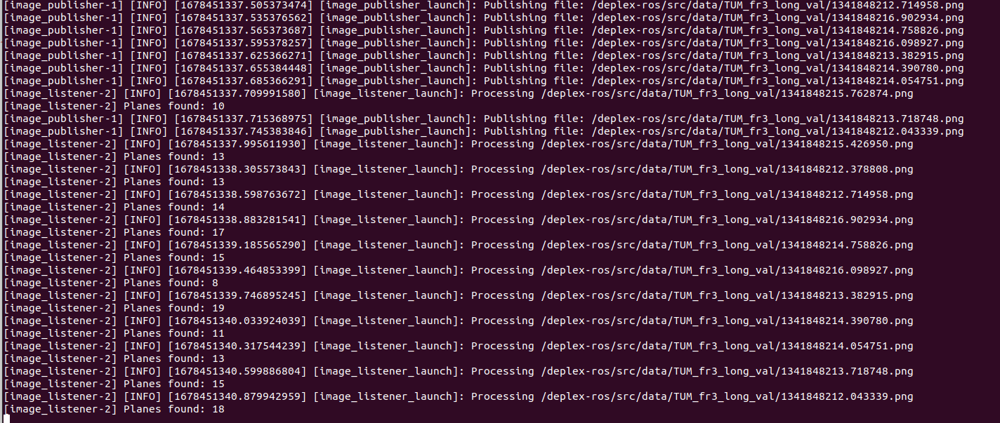

## deplex-ros
Example of ROS 2 publisher-subscriber system using our plane extraction library -- [deplex](https://github.com/prime-slam/deplex)

## Instruction
### Build Docker image
```
docker build -t deplexros:latest .
```
### Run
```
docker run -it deplexros:latest 
```
### Output example


## License
Apache License, Version 2.0